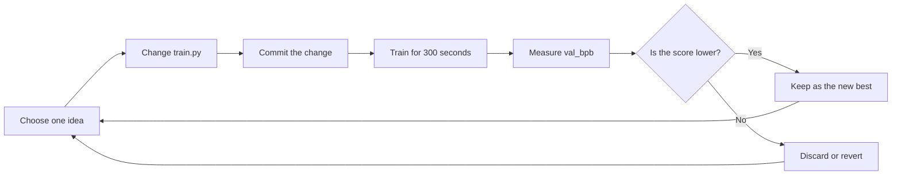

# Autoresearch for Beginners

This guide explains what this repository is doing in plain language. You do not
need to know the details of neural-network mathematics to follow the basic
workflow.

## The idea in one sentence

Autoresearch lets an AI agent act like a small research assistant: it changes
one part of an LLM training program, trains the model for a fixed amount of
time, measures the result, and keeps the change only when the score improves.

## What is being trained?

This project trains a small **language model**. A language model reads text as
a sequence of **tokens** and learns to predict what token is likely to come
next.

For example, after seeing:

```text
The cat sat on the
```

the model may assign a high probability to `mat`.

Training repeats this process over many examples. When the model guesses badly,
the training code adjusts its internal numbers, called **parameters**, so that
similar guesses are more likely to be correct next time.

## The experiment loop

Each experiment is deliberately small and repeatable. The agent changes one
focused idea in `train.py`, then compares it with the current best version.



The important rule is **one meaningful change at a time**. If five things
change together and the score improves, we cannot tell which change helped.

## What does the score mean?

The main score is called `val_bpb`, short for **validation bits per byte**.
It measures how surprised the model is by text it did not train on.

- Lower is better.
- A lower score usually means the model predicts the validation text better.
- The validation text is kept separate so the model is tested on text it has
  not directly learned from.
- The fixed training budget makes experiments easier to compare: every run gets
  about five minutes of training, or 300 seconds in this repository.

Do not compare this local `val_bpb` table directly with the upstream nanochat
time-to-GPT-2 leaderboard. They use different hardware, evaluation goals, and
metrics.

## What each important file does

| File | Purpose | Usually changed by |
|---|---|---|
| `train.py` | The model, optimizer, and training loop. This is the experiment file. | The agent |
| `prepare.py` | Downloads/prepares data, trains the tokenizer, loads batches, and evaluates the model. | Nobody during normal experiments |
| `program.md` | Instructions that tell an AI agent how to run experiments. | The human |
| `results.tsv` | Detailed record of individual experiments. | The agent or human |
| `leaderboard.tsv` | Compact ranking of the best runs. | The agent or human |
| `README.md` | Current RunPod runbook, status, and monitoring commands. | The human/agent maintaining the project |
| `PROJECT_README.md` | Upstream-style overview of the original autoresearch project. | Project documentation |

The evaluation logic in `prepare.py` is the measuring stick. Keeping it fixed
helps ensure that a score change comes from the experiment rather than from
changing the test.

## Before the first experiment

You need:

- One NVIDIA GPU. The current runbook uses a RunPod H100, but other suitable
  GPUs may work.
- Python 3.10 or newer.
- The `uv` Python project manager.
- The prepared dataset and tokenizer.

The basic setup is:

```bash
uv sync
uv run prepare.py
```

Then run one baseline without changing anything:

```bash
uv run train.py
```

The baseline tells us how the untouched code performs. Every later experiment
should be compared with it and with the best result so far.

## How to read a run

At the end of training, the log prints values like these:

```text
val_bpb:          1.004616
training_seconds: 300.1
peak_vram_mb:     45060.2
mfu_percent:      39.80
total_tokens_M:   499.6
```

- `val_bpb`: the main quality score; lower is better.
- `training_seconds`: how long the timed training phase lasted.
- `peak_vram_mb`: the most GPU memory used; too much can cause an out-of-memory
  crash.
- `mfu_percent`: an estimate of how efficiently the GPU was used.
- `total_tokens_M`: how many millions of text tokens the model processed.

A run can be fast and use the GPU efficiently but still be worse if its
`val_bpb` is higher. Quality comes first, provided the run fits the hardware
and completes successfully.

## What kinds of ideas can be tested?

Examples include:

- changing the learning-rate schedule;
- changing optimizer settings;
- changing the attention pattern;
- simplifying or adjusting part of the model architecture;
- changing batch-size or model-size settings when the experiment budget allows.

For a fair experiment, change one focused variable, record what happened, and
leave the data preparation and evaluation harness alone.

## A simple result decision

After a run, ask:

1. Did it finish without crashing?
2. Is its `val_bpb` lower than the current best?
3. Does it fit within the available GPU memory?
4. Is the change simple enough to be worth keeping?

If the answer to the second question is yes and the run is healthy, it is a
candidate for the new best checkpoint. Otherwise, record it as a discarded or
failed experiment and return to the previous best version.

## Beginner glossary

- **Agent**: the AI assistant that proposes and runs experiments.
- **Checkpoint**: a saved copy of the model's learned parameters.
- **Commit**: a Git snapshot of a code change.
- **GPU / VRAM**: the processor and memory used for fast model training.
- **LLM**: large language model; a model trained to work with text.
- **Parameter**: a learned number inside the model.
- **Tokenizer**: the component that turns text into tokens and tokens back into
  text.
- **Training split**: text used to adjust the model.
- **Validation split**: separate text used to measure how well the model
  generalizes.

## Where to go next

Read the [current runbook](README.md) for the active experiment status,
RunPod commands, and the project leaderboard. Read [`program.md`](program.md)
to see the instructions used to run an autonomous experiment loop.
